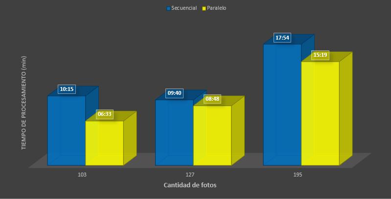
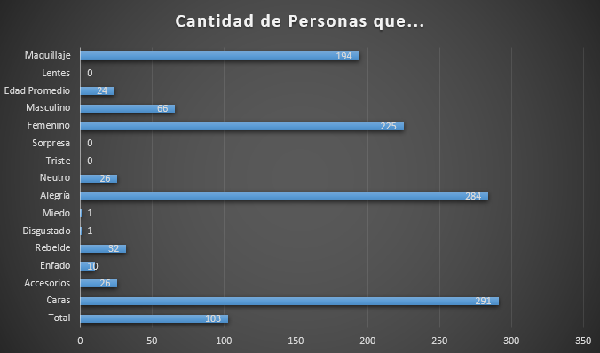
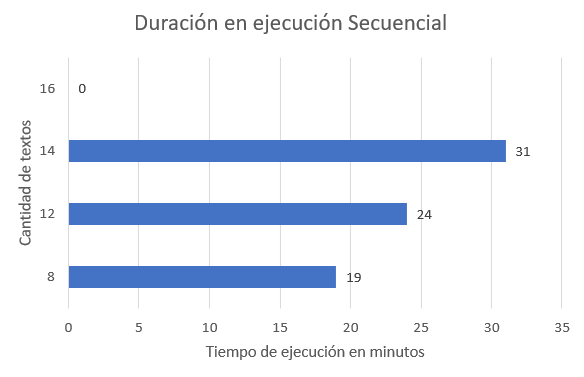
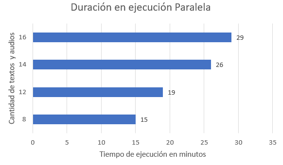

# ProyectoMultiprocesamiento-SO
## Implementación de Azure Services y multiprocesamiento 
### Introducción

Se realizará un análisis de los resultados obtenidos del multiprocesamiento aplicado en el uso de diversos servicios de Microsoft Azure. En donde se utilizará del servicio de voz el text to speech, así como speech translation.

### Análisis de Resultados 

#### Servicio de Visión

En este apartado se realizaron pruebas con diferentes cantidades de fotos, entre ellas fueron 103, 127 y 195, la diferencia de los tiempos respecto al método secuencial y paralelo son variados, debido que con unas cantidades se muestra gran diferencia en la optimización de la duración, pero con otras cantidades no es muy significativo el cambio que se revela, a continuación se muestra un gráfico para visualizar mejor estos procesos:

En el gráfico se está representando las cantidades de fotos por el tiempo de duración del método tanto en secuencial como en paralelo. 
  
  *El el proceso con 103 fotos de manera secuencial duró 10minutos con 15 segundos y de forma paralela duró 6minutos con 33segundos, por lo que se logró reducir 4minutos aproximadamente.
  
  *El el proceso con 127 fotos de manera secuencial duró 9minutos con 40 segundos y de forma paralela duró 8minutos con 48segundos, por lo que se logró reducir un aproximado de apenas 1minuto.
  
  *El el proceso con 195 fotos de manera secuencial duró 17minutos con 54 segundos y de forma paralela duró 15minutos con 19segundos, por lo que se logró reducir un aproximado de casi 3minutos.

De acuerdo con los resultados, se muestra que se logra reducir los tiempo aunque no con grandes diferencias, pero esto también se debe a la calidad de Internet que se tenga en el momento u otros aspecto de procesamiento.

Además, para cada imagen se le obtuvieron distintas características y se analizaron con respecto al primer grupo de imagénes que eran 103 fotos:

En este gráfico se muestra que del total que eran 103 fotos, se detectaron 291 caras, de esas caras o personas se identificó 26 con accesorios, y hubieron distintas emociones como una persona con enfado, otra persona con miedo y otra persona con disgusto, no se encontraron personas sorprendidas ni tristes, habían 284 que presentaban alegría, así también 32 personas rebeldes y 26 personas con un estado neutro, además, también se encontró que 225 personas eran femeninas y 66 personas masculinas, también se sabe que la edad promedio de todas esas personas es 24 años y 194 presentan maquillaje en la fotos.

#### Text to Speech y Speech translation

Con respecto al análisis de textos y audios con estos servicios de voz de forma secuencial los tiempos obtenidos con los siguientes:

Con respecto al análisis de textos y audios con estos servicios de voz de forma paralela los tiempos obtenidos con los siguientes:

